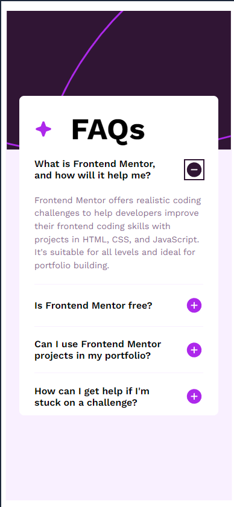
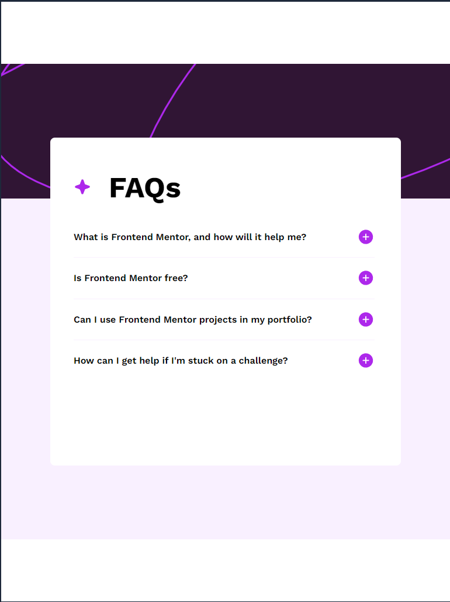
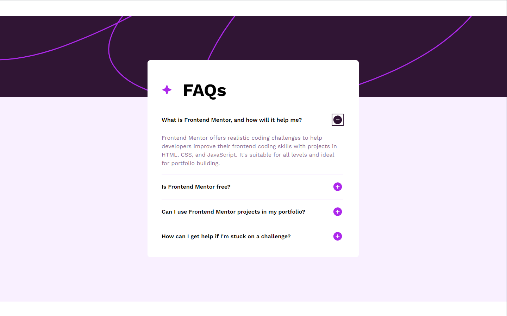

# Frontend Mentor - FAQ accordion solution

This is a solution to the [FAQ accordion challenge on Frontend Mentor](https://www.frontendmentor.io/challenges/faq-accordion-wyfFdeBwBz). Frontend Mentor challenges help you improve your coding skills by building realistic projects.

## Table of contents

- [Overview](#overview)
  - [The challenge](#the-challenge)
  - [Screenshot](#screenshot)
  - [Links](#links)
- [My process](#my-process)
  - [Built with](#built-with)
  - [What I learned](#what-i-learned)

## Overview

### The challenge

Users should be able to:

- Hide/Show the answer to a question when the question is clicked
- Navigate the questions and hide/show answers using keyboard navigation alone
- View the optimal layout for the interface depending on their device's screen size
- See hover and focus states for all interactive elements on the page

### Screenshot

- Mobile
  
- Tablet
  
- Desktop
  

### Links

- Solution URL: [Add solution URL here](https://github.com/tortiman/faq_accordion)
- Live Site URL: [Add live site URL here](https://tortiman.github.io/faq_accordion/)

## My process

### Built with

- Semantic HTML5 markup
- CSS custom properties
- Flexbox
- Mobile-first workflow

### What I learned

I learned to use asistive technologies.

```html
<p
  id="question1"
  aria-expanded="false"
  aria-controls="answer1"
  class="question"
  tabindex="2"
  role="button"
  aria-label="What is Frontend Mentor, and how will it help me?"
></p>
```
